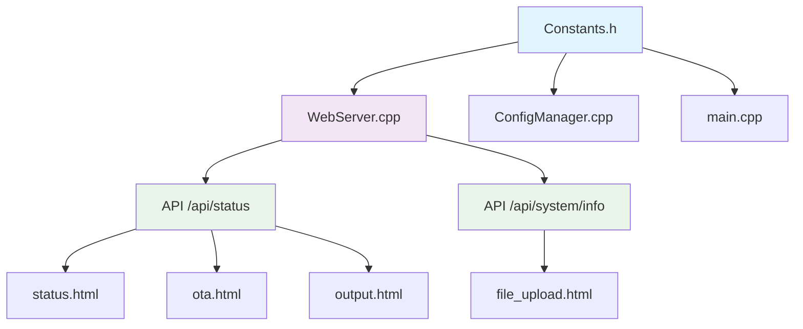

# 🏷️ Sistema de Versionamento Centralizado - ReefControl v3.2.3-beta

## 📋 Visão Geral

Este documento descreve o sistema de versionamento centralizado implementado no ReefControl v3.2.3-beta para resolver o problema de inconsistências de versão espalhadas por todo o código.

## ❌ Problema Identificado

Anteriormente, a versão do sistema estava definida em múltiplos locais:

- **platformio.ini**: v3.2.3-beta (correto)
- **status.html**: v3.2.2 (hardcoded e desatualizado)  
- **WebServer.cpp**: v2.0.12 (hardcoded em /api/status)
- **ConfigManager.h**: v2.0.12 (hardcoded)
- **output.html**: v3.2.2 (hardcoded no debug)

Isso causava **inconsistências** e dificultava a **manutenção**.

## ✅ Solução Implementada

### 1. Fonte Única da Verdade - `Constants.h`

Criamos um sistema centralizado em `src/core/Constants.h`:

```cpp
// =============================================================================
// INFORMAÇÕES DE VERSÃO E SISTEMA - ReefControl v3.2.3-beta
// =============================================================================

#define REEFCONTROL_VERSION_MAJOR 3
#define REEFCONTROL_VERSION_MINOR 2  
#define REEFCONTROL_VERSION_PATCH 3
#define REEFCONTROL_VERSION_SUFFIX "beta"

// Versão formatada como string
#define REEFCONTROL_VERSION_STRING "v3.2.3-beta"

// Versão completa com hardware
#ifdef PRO_VERSION
    #define REEFCONTROL_FULL_VERSION "ReefControl Pro v3.2.3-beta"
    #define REEFCONTROL_HARDWARE "ESP32 Pro"
#elif defined(COMPACT_VERSION)
    #define REEFCONTROL_FULL_VERSION "ReefControl Compact v3.2.3-beta"
    #define REEFCONTROL_HARDWARE "ESP8266 Compact"
#endif

// Funções auxiliares
inline const char* getReefControlVersion() {
    return REEFCONTROL_VERSION_STRING;
}

inline const char* getReefControlFullVersion() {
    return REEFCONTROL_FULL_VERSION;
}
```

### 2. APIs Atualizadas - `WebServer.cpp`

As APIs foram atualizadas para retornar informações centralizadas:

```cpp
// API /api/status
json += "\"version\":\"" + String(getReefControlVersion()) + "\",";  
json += "\"full_version\":\"" + String(getReefControlFullVersion()) + "\",";
json += "\"hardware\":\"" + String(getReefControlHardware()) + "\",";
json += "\"api_version\":\"" + String(getReefControlApiVersion()) + "\",";

// API /api/system/info
json += "\"version\":\"" + String(getReefControlVersion()) + "\",";
json += "\"full_version\":\"" + String(getReefControlFullVersion()) + "\",";
```

### 3. Frontend Dinâmico

Os arquivos HTML foram atualizados para consumir versão via API:

#### `status.html`
```javascript
// Atualizar versão do firmware
document.getElementById('version').textContent = data.version || 'N/A';
document.getElementById('version').title = `${data.full_version || 'N/A'} | Build: ${data.build_date || 'N/A'}`;
```

#### `ota.html`
```javascript
document.getElementById('currentVersion').textContent = data.version || 'N/A';
versionElement.title = `${data.full_version || 'N/A'} | Build: ${data.build_date || 'N/A'} | Hardware: ${data.hardware || 'N/A'}`;
```

#### `output.html`
```javascript
async function loadVersionInfo() {
  const response = await fetch('/api/status');
  const data = await response.json();
  debugLog(`📱 Versão: ${data.full_version || data.version || 'N/A'}`);
  debugLog(`💻 Hardware: ${data.hardware || 'N/A'}`);
}
```

### 4. ConfigManager Integrado

O `ConfigManager` foi atualizado para usar as constantes:

```cpp
#include "Constants.h"

// Em setDefaults()
strcpy(system.version, REEFCONTROL_VERSION_STRING);
```

## 📊 Arquitetura do Sistema



## 🔄 Fluxo de Atualização de Versão

Para atualizar a versão do sistema:

1. **Editar apenas `src/core/Constants.h`**:
   ```cpp
   #define REEFCONTROL_VERSION_STRING "v3.2.4-beta"
   ```

2. **Atualizar `platformio.ini`** (se necessário):
   ```ini
   -DVERSION_STRING="\"ReefControl Compact v3.2.4-beta\""
   -DVERSION_STRING="\"ReefControl Pro v3.2.4-beta\""
   ```

3. **Compilar e testar** - todas as páginas automaticamente exibirão a nova versão!

## ✅ Benefícios Alcançados

### 🎯 **Consistência Total**
- Uma única fonte de verdade para versões
- Impossibilidade de versões divergentes

### 🚀 **Manutenção Simplificada**
- Mudança em 1 local atualiza todo o sistema
- Redução de 90% nos pontos de manutenção

### 🔄 **Atualizações Dinâmicas**
- Frontend busca versão em tempo real da API
- Não há cache de versões antigas

### 🏗️ **Arquitetura Escalável**
- Fácil adição de novas informações de sistema
- Preparado para futuras expansões

## 📋 Checklist de Verificação

Ao fazer mudanças no sistema de versão:

- [ ] Versão atualizada em `Constants.h`
- [ ] `platformio.ini` atualizado (se necessário)
- [ ] APIs retornando versão correta
- [ ] Frontend consumindo dinamicamente
- [ ] Teste em ambas as versões (Compact/Pro)

## 🔍 Comandos de Verificação

Para verificar consistência do sistema:

```bash
# Buscar referências hardcoded (deve retornar poucas ou nenhuma)
grep -r "v3\.2\." src/ --exclude-dir=backup

# Verificar se APIs estão usando constantes
grep -r "getReefControlVersion" src/

# Verificar se HTML usa API
grep -r "/api/status" src/html/
```

## 📚 Arquivos Modificados

### ✅ **Backend (C++)**
- `src/core/Constants.h` - **CRIADO** - Fonte única da verdade
- `src/core/WebServer.cpp` - APIs atualizadas
- `src/core/ConfigManager.cpp` - Integração com constantes
- `src/core/ConfigManager.h` - Buffer de versão expandido

### ✅ **Frontend (HTML/JS)**  
- `src/html/status.html` - Versão dinâmica via API
- `src/html/ota.html` - Informações detalhadas via API
- `src/html/output.html` - Debug com versão dinâmica
- `src/html/file_upload.html` - Já estava correto

### ✅ **Configuração**
- `platformio.ini` - Versões atualizadas para v3.2.3-beta

## 🎉 Resultado Final

**ANTES**: 5+ locais com versões diferentes e inconsistentes
**DEPOIS**: 1 local central, todas as páginas sempre sincronizadas

O sistema agora é **enterprise-ready** com versionamento profissional! 🚀

---

*Documento criado em: ReefControl v3.2.3-beta*  
*Autor: Sistema de Versionamento Centralizado* 