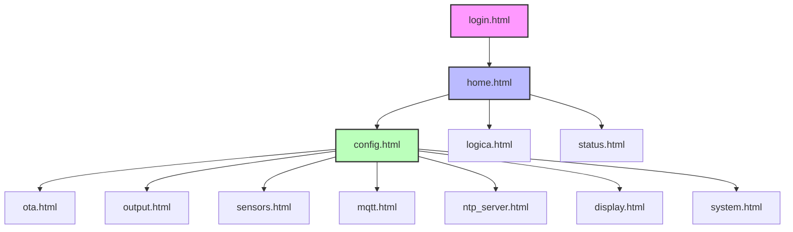

# Documentação Frontend - ReefControl

## Estrutura de Arquivos

### Fluxo de Navegação


### Hierarquia de Navegação
```
login.html (Autenticação)
└── home.html (Dashboard Principal)
    ├── config.html (Central de Configurações)
    │   ├── ota.html (🚀 Updates OTA - Alta Prioridade)
    │   ├── output.html (🔌 Saídas/Relés - Média Prioridade)
    │   ├── sensors.html (📊 Sensores - Média Prioridade)
    │   ├── mqtt.html (📡 MQTT/IoT - Baixa Prioridade)
    │   ├── ntp_server.html (🕐 Servidor NTP - Baixa Prioridade)
    │   ├── display.html (📺 Display - Baixa Prioridade)
    │   └── system.html (⚙️ Sistema - Alta Prioridade)
    ├── logica.html (🧠 Automações)
    └── status.html (📈 Status do Sistema)
```

### Detalhes da Navegação

1. **Login → Home**
   - Autenticação obrigatória
   - Armazenamento em sessionStorage
   - Redirecionamento automático se não autenticado

2. **Home (Dashboard)**
   - Cards de status em tempo real:
     - Temperatura (°C)
     - pH
     - TDS (ppm)
     - Nível de água (%)
   - Atualização automática a cada 5 segundos
   - Menu principal com 3 opções:
     - Configurações (⚙️)
     - Automações (🧠)
     - Status (📈)

3. **Configurações (Central)**
   - Alta Prioridade:
     - Updates OTA (🚀)
     - Sistema (⚙️)
   - Média Prioridade:
     - Saídas/Relés (🔌)
     - Sensores (📊)
   - Baixa Prioridade:
     - MQTT/IoT (📡)
     - Servidor NTP (🕐)
     - Display (📺)

### Diretórios HTML
```
/data/html/          # Arquivos HTML para o sistema de arquivos
    ├── config.html      # (3.4KB) - Configurações gerais
    ├── display.html     # (8.0KB) - Interface do display
    ├── file_upload.html # (8.5KB) - Upload de arquivos
    ├── home.html        # (5.8KB) - Dashboard principal
    ├── logica.html      # (4.6KB) - Regras e automações
    ├── login.html       # (2.4KB) - Página de login
    ├── mqtt.html        # (6.2KB) - Configuração MQTT
    ├── ntp_server.html  # (20KB)  - Configuração NTP
    ├── ota.html         # (7.0KB) - Atualização OTA
    ├── output.html      # (28KB)  - Controle de saídas
    ├── sensors.html     # (19KB)  - Gerenciamento de sensores
    ├── status.html      # (6.0KB) - Status do sistema
    ├── system.html      # (5.9KB) - Configurações do sistema
    └── test_api.html    # (2.3KB) - Teste de APIs

/src/html/           # Templates HTML para compilação
    ├── config.html      # (3.4KB) - Template de configurações
    ├── display.html     # (8.0KB) - Template do display
    ├── file_upload.html # (8.5KB) - Template de upload
    ├── home.html        # (3.7KB) - Template do dashboard
    ├── logica.html      # (4.6KB) - Template de automações
    ├── login.html       # (2.4KB) - Template de login
    ├── mqtt.html        # (6.2KB) - Template MQTT
    ├── ntp_server.html  # (20KB)  - Template NTP
    ├── ota.html         # (7.0KB) - Template OTA
    ├── output.html      # (28KB)  - Template de saídas
    ├── sensors.html     # (6.9KB) - Template de sensores
    ├── status.html      # (6.0KB) - Template de status
    └── system.html      # (5.9KB) - Template do sistema
```

### Páginas Principais
1. **home.html** - Dashboard Principal
   - Cards de status dos sensores
   - Menu de navegação principal
   - Atualização automática a cada 5s
   - Integração com `/api/sensors` e `/api/status`
   - Exemplo de uso:
   ```javascript
   function updateStats() {
       fetch('/api/sensors')
           .then(r => r.json())
           .then(data => {
               document.getElementById('temp').textContent = data.temp + '°C';
               document.getElementById('ph').textContent = data.ph;
               document.getElementById('tds').textContent = data.tds + ' ppm';
               document.getElementById('level').textContent = data.level + '%';
           });
   }
   setInterval(updateStats, 5000);
   ```

2. **sensors.html** - Gerenciamento de Sensores
   - Configuração de sensores DS18B20
   - Interface de calibração
   - Scan de sensores OneWire
   - Gerenciamento de nomes e offsets
   - Exemplo de uso:
   ```javascript
   async function calibrateSensor(address) {
       const realTemp = parseFloat(document.getElementById('realTemp').value);
       const response = await fetch('/api/ds18b20/calibrate', {
           method: 'POST',
           headers: { 'Content-Type': 'application/json' },
           body: JSON.stringify({ address, temperature: realTemp })
       });
   }
   ```

3. **status.html** - Monitoramento do Sistema
   - Status detalhado de todos os componentes
   - Logs do sistema
   - Informações de conectividade
   - Métricas de performance
   - Exemplo de uso:
   ```javascript
   function refreshStatus() {
       fetch('/api/status')
           .then(r => r.json())
           .then(data => {
               document.getElementById('uptime').textContent = data.uptime;
               document.getElementById('memory').textContent = data.memory + '%';
               document.getElementById('wifi').textContent = data.wifi_status;
           });
   }
   ```

4. **config.html** - Configurações Gerais
   - Configurações do sistema
   - Parâmetros de rede
   - Opções de display
   - Configurações de segurança

5. **output.html** - Controle de Saídas
   - Gerenciamento de relés
   - Programação de timers
   - Status das saídas
   - Modos manual/automático

6. **mqtt.html** - Configuração MQTT
   - Configurações do broker
   - Tópicos de publicação/subscrição
   - Status da conexão
   - Logs MQTT

7. **logica.html** - Automações
   - Regras de automação
   - Condições e ações
   - Programações
   - Status das automações

## Componentes de Interface

### Cards de Status
```html
<div class="stat-card">
    <div class="stat-value status-ok" id="temp">24.5°C</div>
    <div class="stat-label">Temperatura</div>
</div>
```
- Classes de status: `status-ok`, `status-warning`, `status-error`
- Atualização dinâmica via JavaScript
- Indicadores visuais de estado

### Botões e Controles
```html
<button class="btn btn-primary">Salvar</button>
<button class="btn btn-warning">Calibrar</button>
<button class="btn btn-danger">Remover</button>
```
- Classes de botões: `btn-primary`, `btn-warning`, `btn-danger`
- Estados: normal, hover, active, disabled
- Feedback visual de ações

### Formulários
```html
<div class="form-group">
    <label>Nome do Sensor:</label>
    <input type="text" class="form-control">
</div>
```
- Validação em tempo real
- Feedback de erros
- Estilos responsivos
- Labels informativos

## Estilos CSS

### Sistema de Grid
```css
/* Grid principal */
.container {
    max-width: 1200px;
    margin: 0 auto;
    padding: 1rem;
}

.grid {
    display: grid;
    grid-template-columns: repeat(auto-fit, minmax(250px, 1fr));
    gap: 1rem;
}

/* Cards de status */
.stat-card {
    background: white;
    padding: 1.5rem;
    border-radius: 10px;
    box-shadow: 0 4px 6px rgba(0,0,0,0.1);
}

/* Responsividade */
@media (max-width: 768px) {
    .container { padding: 0.5rem; }
    .grid { grid-template-columns: 1fr; }
}
```

### Temas e Cores
```css
:root {
    /* Cores principais */
    --primary: #4a90e2;
    --warning: #f0ad4e;
    --danger: #d9534f;
    --success: #5cb85c;
    
    /* Tons de cinza */
    --text: #333333;
    --background: #f5f7fa;
    --border: #e1e4e8;
    
    /* Status */
    --status-ok: #28a745;
    --status-warning: #ffc107;
    --status-error: #dc3545;
}
```

## Componentes JavaScript

### Atualização Automática
```javascript
class SensorUpdater {
    constructor(interval = 5000) {
        this.interval = interval;
        this.running = false;
    }

    start() {
        if (this.running) return;
        this.running = true;
        this.update();
        this.timer = setInterval(() => this.update(), this.interval);
    }

    stop() {
        if (this.timer) {
            clearInterval(this.timer);
            this.running = false;
        }
    }

    async update() {
        try {
            const response = await fetch('/api/sensors');
            const data = await response.json();
            this.updateUI(data);
        } catch (error) {
            console.error('Erro ao atualizar sensores:', error);
        }
    }

    updateUI(data) {
        // Atualiza temperatura
        if (data.sensors && data.sensors[0]) {
            document.getElementById('temp').textContent = 
                data.sensors[0].temperature.toFixed(1) + '°C';
        }
        
        // Atualiza outros sensores
        document.getElementById('ph').textContent = data.ph || '--';
        document.getElementById('tds').textContent = (data.tds || '--') + ' ppm';
        document.getElementById('level').textContent = (data.level || '--') + '%';
    }
}

// Uso
const updater = new SensorUpdater(5000);
updater.start();
```

### Gerenciamento de Sensores
```javascript
class SensorManager {
    async scanSensors() {
        const response = await fetch('/api/onewire/scan');
        const sensors = await response.json();
        return sensors;
    }

    async addSensor(address, name) {
        const response = await fetch('/api/ds18b20/add', {
            method: 'POST',
            headers: { 'Content-Type': 'application/json' },
            body: JSON.stringify({ address, name })
        });
        return response.json();
    }

    async calibrateSensor(address, temperature) {
        const response = await fetch('/api/ds18b20/calibrate', {
            method: 'POST',
            headers: { 'Content-Type': 'application/json' },
            body: JSON.stringify({ address, temperature })
        });
        return response.json();
    }

    async removeSensor(address) {
        const response = await fetch('/api/ds18b20/remove', {
            method: 'POST',
            headers: { 'Content-Type': 'application/json' },
            body: JSON.stringify({ address })
        });
        return response.json();
    }
}
```

## APIs e Endpoints

### Sensores
- `GET /api/sensors` - Lista todos os sensores
- `POST /api/sensors/config` - Salva configurações
- `GET /api/sensors/scan` - Busca novos sensores
- `POST /api/sensors/calibrate` - Calibra sensor

### Sistema
- `GET /api/status` - Status do sistema
- `GET /api/logs` - Logs do sistema
- `POST /api/config` - Salva configurações
- `GET /api/metrics` - Métricas de performance

### Saídas
- `GET /api/outputs` - Status das saídas
- `POST /api/outputs/toggle` - Liga/desliga saída
- `POST /api/outputs/schedule` - Programa timer
- `GET /api/outputs/status` - Status detalhado

## Responsividade

### Breakpoints
```css
/* Mobile */
@media (max-width: 576px) {
    .container { padding: 0.5rem; }
    .grid { grid-template-columns: 1fr; }
}

/* Tablet */
@media (max-width: 768px) {
    .status-grid { grid-template-columns: repeat(2, 1fr); }
}

/* Desktop */
@media (min-width: 992px) {
    .container { max-width: 1200px; }
}
```

### Layout Adaptativo
- Cards empilhados em mobile
- Menus colapsáveis
- Fontes responsivas
- Touch-friendly em mobile

## Segurança

### Autenticação
```javascript
class Auth {
    static check() {
        if (!sessionStorage.getItem('loggedIn')) {
            window.location.href = 'login.html';
            return false;
        }
        return true;
    }

    static login(username, password) {
        // Implementação do login
    }

    static logout() {
        sessionStorage.removeItem('loggedIn');
        window.location.href = 'login.html';
    }
}

// Uso em cada página
if (!Auth.check()) {
    // Redireciona para login
}
```

### Validação
```javascript
class Validator {
    static temperature(value) {
        const temp = parseFloat(value);
        return !isNaN(temp) && temp >= 0 && temp <= 40;
    }

    static sensorName(value) {
        return value && value.length >= 3 && value.length <= 50;
    }

    static sensorAddress(value) {
        return /^[0-9A-Fa-f]{16}$/.test(value);
    }
}
```

## Performance

### Otimizações
- Minificação de CSS/JS
- Compressão gzip
- Cache de recursos
- Lazy loading de imagens

### Monitoramento
- Tempo de resposta
- Uso de memória
- Erros de JavaScript
- Performance de rede

## Acessibilidade

### Práticas ARIA
```html
<button 
    aria-label="Calibrar sensor"
    role="button"
    aria-pressed="false">
    Calibrar
</button>
```
- Labels descritivos
- Roles semânticos
- Estados interativos
- Navegação por teclado

## Debug e Desenvolvimento

### Sistema de Logs
```javascript
class Logger {
    static DEBUG = true;

    static log(message, data = null) {
        if (this.DEBUG) {
            console.log(`[LOG] ${message}`, data);
        }
    }

    static error(message, error = null) {
        console.error(`[ERROR] ${message}`, error);
    }

    static warn(message, data = null) {
        console.warn(`[WARN] ${message}`, data);
    }
}

// Uso
Logger.log('Atualizando sensores...');
Logger.error('Falha ao conectar', error); 